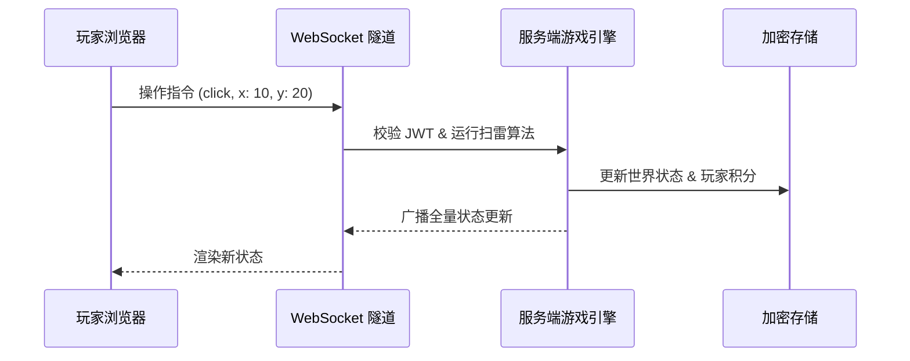

# 🚩 Infinite Multiplayer Minesweeper

> 一个基于 **Nuxt 4 + Vue 3 + WebSocket** 构建的具备 **Liquid Glass** 美学的无限地图多人实时联机扫雷游戏。


[](https://nuxt.com)
[](https://vuejs.org)
[](https://www.typescriptlang.org)
[](https://tailwindcss.com)
[](LICENSE)

🌐 **Demo**: [nuxtminesweeper.netlify.app](https://nuxtminesweeper.netlify.app/)

---

## ✨ 核心特性

- 🌌 **无限地图** — 基于坐标哈希的程序化生成，地图向四面八方无限延展，永无边界。
- 💎 **Liquid Glass 设计** — 采用毛玻璃效果 (Glassmorphism) 的浮动 HUD，提供极具现代感的视觉交互体验。
- ⚔️ **多人实时联机** — 基于 WebSocket 全双工通讯，全球玩家在同一张地图上实时协作、竞技扫雷。
- 🖼️ **Canvas 高刷渲染** — 棋盘主体采用 Canvas 绘制，避免大规模 DOM 方块重排，拖拽与缩放更适合高刷新率屏幕。
- 🛡️ **服务端驱动架构** — 前端仅负责像素级渲染与指令发送，所有地雷判定、分数计算与状态管理均在服务端原子化完成。
- 💀 **生存模式** — 没有 Game Over！踩雷扣 10 分，安全翻开 +1 分，存活并登顶排行榜。
- 🔊 **程序化音效** — 零资源文件加载，纯 Web Audio API 实时合成挖雷、插旗、爆炸等高保真音效。
- 📍 **精准定位与传送** — 实时坐标追踪，支持通过输入坐标精确传送至地图任何角落。
- 🎯 **重生机制** — 点击动态表情笑脸即可随机传送至新大陆，积分完美继承。
- 🔐 **企业级安全** — 完善的注册/登录体系，采用 `scrypt` 强哈希加密与 `AES-256-GCM` 玩家数据加密存储。
- 📱 **全平台兼容** — 深度优化的触屏交互，支持单指滑动、长按插旗，适配移动端高刷屏幕。

## 🛠️ 技术栈

| 层级 | 技术 | 亮点 |
| --- | --- | --- |
| **前端框架** | Nuxt 4 + Vue 3 | 极致的性能优化与响应式开发体验 |
| **棋盘渲染** | Canvas 2D | 单画布绘制无限视窗，降低 DOM 压力 |
| **视觉系统** | Nuxt UI + TailwindCSS 4 | Liquid Glass HUD 与响应式界面 |
| **实时通讯** | Nitro WebSocket | 低延迟全双工同步 |
| **身份认证** | JWT (HS256) | 无状态身份验证，支持 7 天免登录 |
| **数据安全** | `crypto.scrypt` + AES-256-GCM | 银行级数据保护方案 |
| **音频引擎** | Web Audio API | 纯算法合成音效，无需等待音频下载 |
| **持久化层** | Nitro `unstorage` | 支持多种后端切换的高效持久化 |

## 📁 项目结构

```
nuxtMinesweeper/
├── assets/
│   ├── logic.ts          # 前端 WebSocket 控制器 (GamePlay 引擎)
│   ├── audio.js          # Web Audio API 音效合成引擎
│   └── style.css         # 全局 Design Tokens & Liquid Glass 样式
├── components/
│   ├── MineBoard.vue     # Canvas 无限棋盘渲染与输入命中测试
│   ├── MineCell.vue      # 旧 DOM 单元组件（保留作样式/交互参考）
│   ├── AuthModal.vue     # 玻璃拟态登录界面
│   └── Footer.vue        # 页面底部
├── pages/
│   └── index.vue         # 游戏主入口（HUD 控制面板 + 实时排行榜）
├── server/
│   ├── api/auth/         # 认证相关 RESTful 接口
│   ├── routes/
│   │   └── ws.ts         # WebSocket 消息分发核心
│   └── utils/
│       ├── gameLogic.ts  # 服务端全局单例游戏引擎
│       └── userStore.ts  # 加密存储适配器
├── data/
│   └── world.json        # 地图持久化状态
├── nuxt.config.ts        # 应用构建配置
└── tailwindcss.config.js # 样式自定义配置
```

## 🏗️ 架构原理解析



- **逻辑闭环**: 前端不持有地雷分布，杜绝通过控制台查看地雷位置。
- **Canvas 视窗**: 客户端只绘制当前可见区域，拖拽时通过 `requestAnimationFrame` 合帧重绘，未知格子不会被批量创建为响应式对象。
- **密度控制**: 恒定 15% 地雷率，基于 `Mulberry32` + `坐标种子` 确保地图的一致性与无限性。
- **防抖保存**: 世界数据通过 2s 防抖机制异步写入磁盘，平衡性能与数据安全性。

## 🚀 快速开始

### 环境要求

- **Node.js** >= 18.x
- **pnpm** >= 8.x

### 安装 & 启动

```bash
# 克隆仓库
git clone https://github.com/Mou7s/nuxtMinesweeper.git
cd nuxtMinesweeper

# 安装依赖
pnpm install

# 启动开发服务器（含 WebSocket 同步）
pnpm dev
```

访问 `http://localhost:3000` 即可开始扫雷。建议同时打开两个窗口观察同步效果。

## 🎮 交互指南

| 动作 | 桌面端 | 触屏端 | 效果 |
| --- | --- | --- | --- |
| **翻开格子** | 左键点击 | 短按 | 安全翻开 (+1分) / 踩雷 (-10分) |
| **标记地雷** | 右键点击 | 长按 | 快速插旗 / 取消标记 |
| **连锁展开** | 左右键同时点击数字 | — | 自动翻开周围安全区域 |
| **地图平移** | 鼠标拖拽 | 单指滑动 | 无极探索无限地图 |
| **地图缩放** | 滚轮 | 双指捏合 | 放大/缩小当前视窗 |
| **快速重生** | 点击笑脸 | 点击笑脸 | 随机传送到新大陆 |
| **精准定位** | 点击坐标 | 点击坐标 | 打开传送面板并输入坐标 |

## 🚀 推荐下一步 (TODO)

> 基于当前项目的成熟度，以下是按 **投入产出比** 排序的后续开发建议。

### 🏆 P0 — 高价值、低投入（建议优先完成）
- [x] **多玩家实时光标**: 通过 WebSocket 广播玩家坐标，在地图上显示带颜色标注的其他玩家光标。这能极大增强“多人联机”的临场感。
- [x] **音效开关与音量调节**: 在 HUD 面板添加一个静音切换按钮，并支持保存玩家的音效偏好。
- [x] **移动端双指缩放**: `Pinch to Zoom` 功能已接入棋盘视窗，提升移动端探索体验。
- [x] **Canvas 渲染引擎迁移**: 棋盘已从 DOM 方块迁移到 Canvas，降低高刷新率拖拽时的渲染压力。

### 🎯 P1 — 增强交互、中等投入（建议 1-2 周内）
- [ ] **极简聊天室**: 侧边浮动聊天窗，支持表情包和坐标快捷发送。
- [ ] **成就勋章系统**: 记录玩家的里程碑（如“扫雷千手观音”、“地雷探知家”），并展示在个人资料和排行榜上。
- [ ] **已探索区域热力图**: 在主界面提供一个小地图入口，可视化显示整张无限地图中玩家探索最密集的区域。

### 🔮 P2 — 架构优化、长期规划（按需推进）
- [ ] **Canvas 绘制细节增强**: 增加 hover 高亮、点击反馈、低倍率小地图密度显示等 Canvas 专属视觉层。
- [ ] **数据库持久化**: 目前采用文件系统 (`world.json`) 存储，建议迁移至 SQLite 或 PostgreSQL，以支持更大规模的数据并发与分析。
- [ ] **房间/赛季系统**: 引入定期重置的赛季制度，或允许玩家创建私人房间并自定义地雷密度。

---

## 🤝 参与贡献

我们非常欢迎 Issue 和 PR！请确保在提交前运行 `pnpm build` 验证项目可以正常构建。

## 📄 许可证

本项目采用 [MIT License](LICENSE) 许可。
